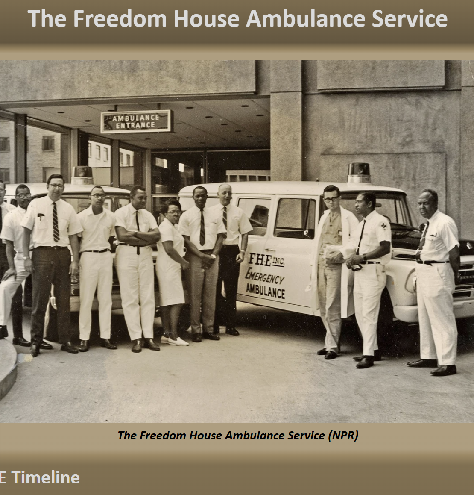

# tribute-page

A tribute page with a snippet of information on the timeline of the Freedom House Ambulance Service.

**Live-Demo:** [https://oendemann.github.io/tribute-page/]

---

---

## About The Project

One of five individual projects that need to be completed as per the web design course on freeCodeCamp. Chose my tribute page to be on The Freedom House Ambulance Service.

---

## Built With

* **HTML:** Used for the structure and content of the webpage, including text, link, and image.
* **CSS:** Used for the design and formatting of the website (e.g. background color, text-placement, font-family, etc).

---

## What I Learned

1. It's important to keep in mind the relationship between variables (parents and children), especially when formatting using CSS.
2. "text-decoration" syntax allows for more control over the stylization of text, such as underlining.

---

## Acknowledgments

* Project idea and requirements from [freeCodeCamp.org](https://www.freecodecamp.org/)